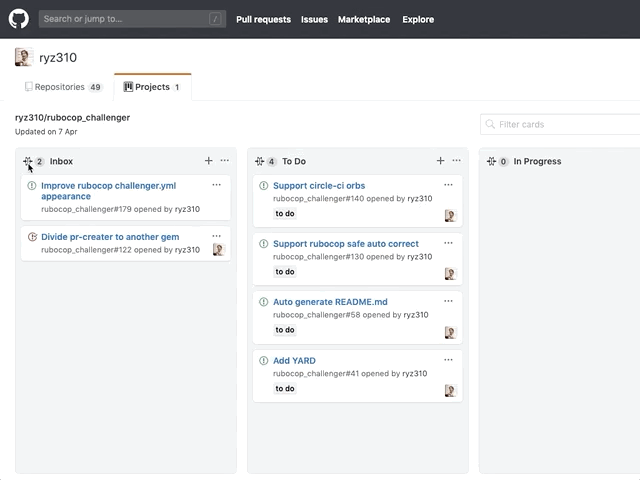

# GitHub Project Enhancer

[**You Can Install Here!**](https://chrome.google.com/webstore/detail/github-project-enhancer/cbggiffagddcdaffgilodfjjjjejmeoh)

Enhance GitHub Projects to add accordion UI and so on.
You can fold project columns.

This extension is now developing. New feature will add soon!
